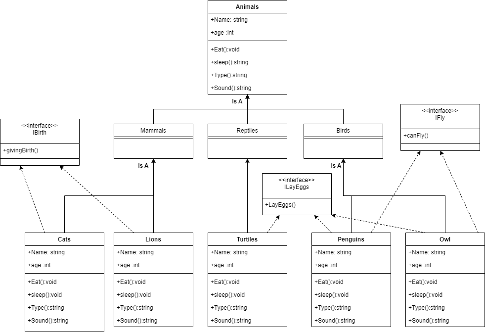

# Lab 06
# Zoo

+ Zoo provides a virtual zoo that represent animals and some type ot them like Mammals and from each type there is some animals. In general this application represents a virtual zoo.

#
## The UML drawing for the Zoo

#
## OOP principles
+ **Encapsulation** : It's to hide the internal implementation details about the class (You can't access directly) like in Bank account system when you encapsulate the Balance to prevent any one from using it.
+ **Inheritance** : It allow you to create new classes based on another existing class and inherit all it's method and attributes but not the constructors it represents the Is A relationship which I used the most in this application.
+ **Polymorphism** : it's to treat the object as instance and it can be achived by override or overload.
+ **Abstraction** : You don't have to know the unneccessary details about the class you can define one class that shares the common behaviours of something and inherit from it and make sure that each abstract method or attribute should be overridden in the inherited class.
#
# Lab 07
## Interfaces
+ An interface is a code structure that defines a contract between an object and its user. It contains a collection of semantically similar properties and methods that can be implemented by a class or a struct that adheres to the contract

## My interfaces 
### I created a 3 simple interfaces that contain a method that specify a feature some animals share.
+ The **IFly** interface in contains the **canFly()** method which determine either the animal is flyable or not and it's implemented by the Owl and Penguin classes but it's contains different returns at each class exapmle:
 ````markdown
//The Owl class
  public string canFly()
        {
            return $"{Name} Can Fly";
        }

//In the penguin class
public string canFly()
        {
            return $"{Name} is a bird but it can't fly";
        }
````
+ The **IBirth** interface which determines if the animal reproduces by Birth and it's implemented by the classes that inherits the Mammals (Cats and Lions).
+ The **ILayEggs** interface which determines if the animal reproduces by Laying eggs and it's implemented by Turtules,Owls and Penguins classes.

#
## Here is a photo of the Class Diagram draw for the program with the interfaces added

